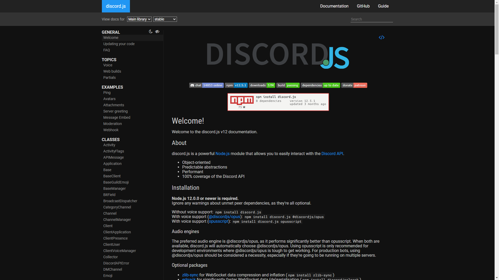
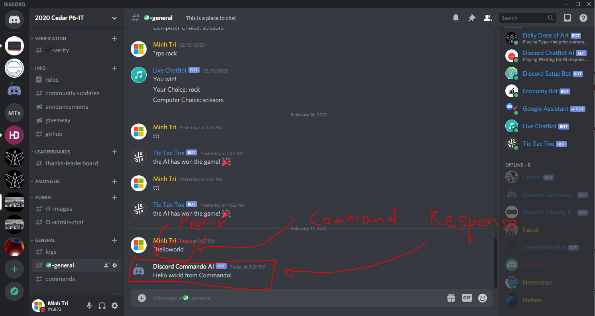

# Creating a Commando command (Discord.JS) (Part 1)

In this chapter, we will create a command for our Discord.JS Commando Bot.

But first, you need to check that you have already filled in the details inside the [config.json](../sources/config.json) file.

If you are done, you can already start on this chapter!

> <b>Note:</b> You can view the Discord.JS Documentation here for better knowledge understanding of Discord.JS Library. I have also created the `docs` command to refer to the Discord.JS Documentation on Discord.<br>
<br>
You can visit it [here](https://discord.js.org/#/docs/main/stable/general/welcome).

Visit the `cmds` folder of the `sources` folder. You will see 14 groups of commands there.

We are going to create a simple command called `hello world`. We are going to put it in the misc group.

However, we will need to place the information inside the [index.js](../sources/index.js) file.

Then navigate to the `Register Commands` section. You will see this:
```js
 . . .

// Register Commands
    client.registry
        .registerGroups([
            ['school', 'School Matters'],
            ['math', 'Mathematics Calculation'],
            ['moderation', 'Moderator'],
            ['evaluation', 'Evaluation'],
            ['channels', 'Set Channels'],
            ['polling', 'Polling'],
            ['giveaway', 'Bot Giveaway'],
            ['games', 'Game Content'],
            ['role', 'Manage Roles'],
            ['server', 'Server Commands'],
            ['settings', 'System Settings'],
            ['outside', 'Happening Outside'],
            ['documentation', 'Discord.JS Documentation'],
            ['suggestions', 'Suggestions'],
            ['thanks', 'Thanks people']
        ])
        .registerDefaults()
        .registerCommandsIn(path.join(__dirname, 'cmds'))

 . . .

```

Then add a comma to the `['thanks', 'Thanks people']` array, then press `ENTER`.
Then type `['misc', 'Misc Commands']`. You can name the `'Misc Commands'` into something you want, but remember to add `'` outside the name.

You will see how it looks like:
```js
 . . .

// Register Commands
    client.registry
        .registerGroups([
            ['school', 'School Matters'],
            ['math', 'Mathematics Calculation'],
            ['moderation', 'Moderator'],
            ['evaluation', 'Evaluation'],
            ['channels', 'Set Channels'],
            ['polling', 'Polling'],
            ['giveaway', 'Bot Giveaway'],
            ['games', 'Game Content'],
            ['role', 'Manage Roles'],
            ['server', 'Server Commands'],
            ['settings', 'System Settings'],
            ['outside', 'Happening Outside'],
            ['documentation', 'Discord.JS Documentation'],
            ['suggestions', 'Suggestions'],
            ['thanks', 'Thanks people'],
            ['misc', 'Misc Commands']
        ])
        .registerDefaults()
        .registerCommandsIn(path.join(__dirname, 'cmds'))

 . . .

```

Now we can create a `misc` folder in the `cmds` folder!

```tree
├───chapters
└───sources
    ├───cmds
    │   ├───channels
    │   ├───documentation
    │   ├───games
    │   ├───giveaway
    │   ├───math
    │   ├───misc
    │   ├───moderation
    │   ├───outside
    │   ├───polling
    │   ├───role
    │   ├───school
    │   ├───server
    │   ├───settings
    │   ├───suggestions
    │   └───thanks
    ├───data
    ├───features
    │   └───features
    ├───schemas
    ├───system
    │   ├───data
    │   ├───games
    │   │   ├───Among Us
    │   │   └───Fast Type
    │   └───moderation
    │       └───mute
    └───utilities
```

Name your file as `hello-world.js` in the `misc` folder.

The first thing we need to import is `discord.js-commando`.

> <b>Note:</b> For better view of the packages and their variables, you can use `npm i` in your terminal.

```js
const Commando = require('discord.js-commando')

```

Then, we will export the file as a module and create a class called `HelloWorldCommand` and extends the Commando command.

```js
const Commando = require('discord.js-commando')

module.exports = class HelloWorldCommand extends Commando.Command {
    
}
```

Now we are going to need a `constructor` . This is going to be around whenever this instance of this class is created. So we're going to have a client object. We will also have a `super` to extends the Commando command for use.

```js
const Commando = require('discord.js-commando')

module.exports = class HelloWorldCommand extends Commando.Command {
    constructor(client) {
        super(client, {

        })
    }
}
```

Fill in the details of the command. I have done some of them for you:

```js
const Commando = require('discord.js-commando')

module.exports = class HelloWorldCommand extends Commando.Command {
    constructor(client) {
        super(client, {
            name: 'helloworld',
            group: 'misc',
            memberName: 'helloworld',
            description: '',
        })
    }
}
```

Did you see that I put the `group` argument to `misc`? It shows where the file we're creating is at which folder, which that folder is called `misc`.

Next, we `run` the callback:

```js
const Commando = require('discord.js-commando')

module.exports = class HelloWorldCommand extends Commando.Command {
    constructor(client) {
        super(client, {
            name: 'helloworld',
            group: 'misc',
            memberName: 'helloworld',
            description: '',
        })
    }

    run = async (message) => {

    }
}
```

So you can see that `run` callback is `asyncronized`, which means that it will do some other important things according to your JavaScript Code while that function is running. But now, we are not using that `async` function, but just apply this in case of a code error.

So we are going to send the message to Discord as `Hello World from Commando!` through `message.reply()`.

```js
const Commando = require('discord.js-commando')

module.exports = class HelloWorldCommand extends Commando.Command {
    constructor(client) {
        super(client, {
            name: 'helloworld',
            group: 'misc',
            memberName: 'helloworld',
            description: '',
        })
    }

    run = async (message) => {
        message.reply('Hello World from Commando!')
    }
}
```

Now you're done! Let's test it out.

But wait a minute. You will need to fill in all the data in the [config.json](../sources/config.json) file. Otherwise, your bot will not work.

Let's test it now!

If you have run the `npm i` command in terminal, you will need to run the command `npm run script`. Otherwise, use the `npm start` command.

Then type in your prefix then `helloworld`.

It will return this response:


So you have finally created a command called Hello World!

> Next chapter will be available soon.